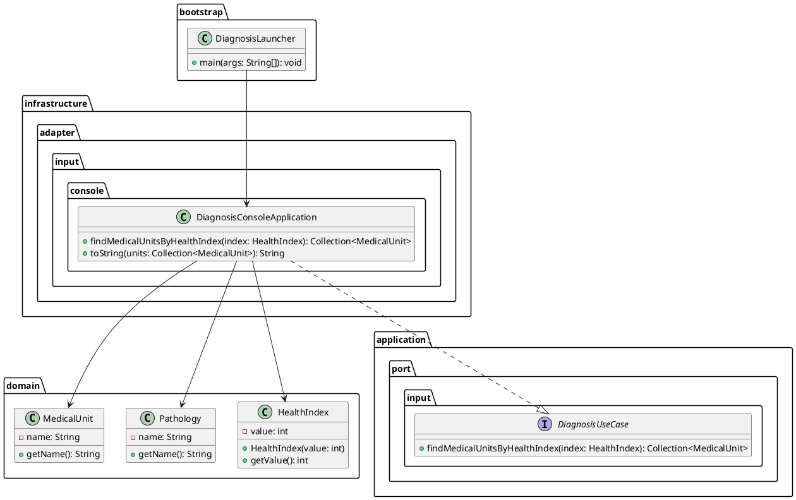
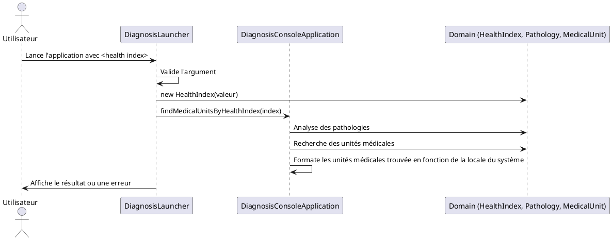
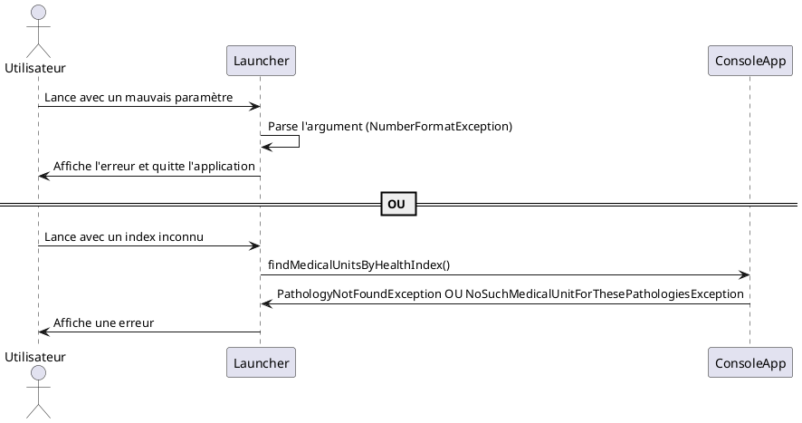

# Auto-diagnostic médical

L’application est un système de diagnostic médical, en architecture hexagonale, conçu pour fournir des diagnostics à partir d’un indice de santé transmis par l’utilisateur. Elle suggère ensuite les unités médicales appropriées pour la prise en charge.

Actuellement, seuls les index de santé multiples de 3 (maladies cardiaques) et de 5 (fractures) sont supportés, tout autre type d'index terminera le programme en erreur.

## Table des Matières

- [Pré-requis](#pré-requis)
- [Installation](#installation)
- [Utilisation](#utilisation)
- [Architecture logicielle](#architecture-logicielle)
- [Contact](#contact)

## Pré-requis
La compilation du projet nécessite un [JDK 23](https://download.java.net/openjdk/jdk23/ri/openjdk-23+37_windows-x64_bin.zip) et [Maven 3.9](https://dlcdn.apache.org/maven/maven-3/3.9.9/binaries/apache-maven-3.9.9-bin.zip).

## Installation
Instructions pour installer le projet :

```bash
git clone https://github.com/remyfrerot/softway-diagnosis.git
cd softway-diagnosis
mvn clean install
```

## Utilisation
```bash
cd softway-diagnosis/target
java -jar diagnosis-1.0-SNAPSHOT-jar-with-dependencies.jar <index de santé>
```

## Architecture logicielle

### Composants

- **Domain**: Contient les entités métier et value objects (ex: Pathology, MedicalUnit, HealthIndex)
- **Application Ports**: Définit la logique applicative t les cas d’utilisation du système (interfaces d'entrée/sortie)
- **Adapters**: Gèrent les interactions avec le monde extérieur (console ici, éventuellement d'autres dans le futur)
- **Bootstrap**: Point d’entrée de l’application, initialise et orchestre la détermination du diagnostic.


### Structure des packages
| Package                                                                    | Rôle                                                                                                                                                                                |
|----------------------------------------------------------------------------|-------------------------------------------------------------------------------------------------------------------------------------------------------------------------------------|
| `com.softway.diagnosis.application`                                        | Logique applicative (coeur métier) avec ports d'entrée/sortie et services métier. Indépendante des technologies et frameworks utilisés.                                             |
| `com.softway.diagnosis.application.port.input`                             | Ports d’entrée (interfaces) pour les cas d’utilisation métier.                                                                                                                      |
| `com.softway.diagnosis.application.port.input.medicalunit`                 | Cas d'utilisation métier liés aux unités médicales (départements, services, spécialités).                                                                                           |
| `com.softway.diagnosis.application.port.input.pathology`                   | Cas d'utilisation métier relatifs aux pathologies et index de santé.                                                                                                                |
| `com.softway.diagnosis.application.port.output.persistence`                | Ports de sortie (interfaces) des différents dépôts de stockage.                                                                                                                     |
| `com.softway.diagnosis.application.service`                                | Services implémentant les cas d'utilisation métier avec intéractions avec les différents dépôts de stockage.                                                                        |
| `com.softway.diagnosis.bootstrap`                                          | Point d’entrée de l’application. Orchestration du lancement et de l'initialisation de la console et validation basique de l'entrée utilisateur.                                     |
| `com.softway.diagnosis.domain.medicalunit`                                 | Entités et logique métier liées aux unités médicales (départements, services, spécialités).                                                                                         |
| `com.softway.diagnosis.domain.pathology`                                   | Entités et logique métier relatives aux pathologies et index de santé.                                                                                                              |
| `com.softway.diagnosis.infrastructure.adapter.input.console`               | Adaptateur console : gère l’interface en ligne de commande, initialise les dépôts de stockage mémoire et orchestre la chaîne d'appels applicatifs avec l'entrée utilisateur valide. |
| `com.softway.diagnosis.infrastructure.adapter.output.persistence.inmemory` | Persistance des entités en mémoire.                                                                                                                                                 |

### Scénario typique de fonctionnement
1. **Entrée utilisateur**: L'utilisateur lance l’application avec un index de santé (en argument de la ligne de commande).
2. **Traitement**:
    - L'index est validé et converti en objet métier . `HealthIndex`
    - Le système identifie les pathologies associées.
    - Pour chaque pathologie, le système trouve les unités médicales pertinentes.

3. **Sortie**: Les résultats sont affichés à l'utilisateur dans la console.

### Diagrammes
#### Diagramme de classes


#### Diagrammes de séquence
##### Cas nominal


##### Cas en erreur


## Contact
[remy.frerot@gmail.com](mailto:remy.frerot@gmail.com)